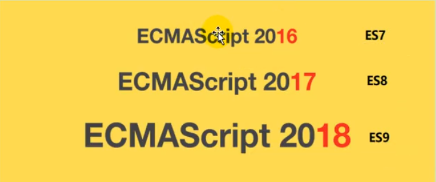
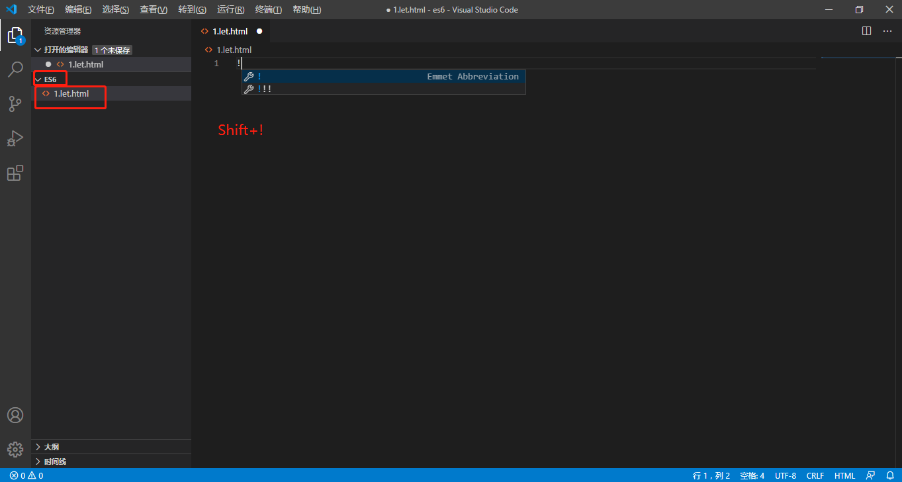
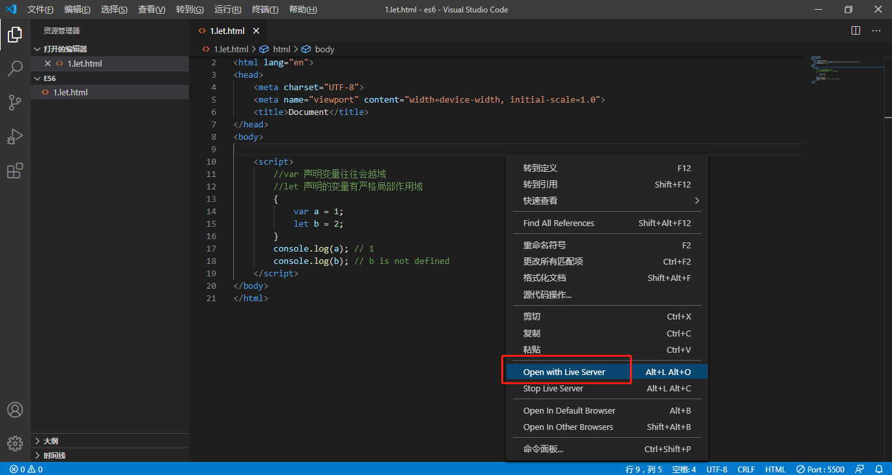

# ES6

## 简介

<font color=red>ECMAScript 6.0</font>(以下简称ES6，ECMAScript是一种由Ecma国际(前身为欧洲计算机制造商协会,英文名称European Computer Manufacturers Association)通过ECMA-262标准化的脚本程序设计语言)</font><font color=red>是JavaScript语言的下一代标准</font>，已经在2015年6月正式发布了，并且从ECMAScript 6.0开始采用年号来做版本。即ECMAScript2015，就是ECMAScript6。它的目标是使得JavaScript语言可以用来编写复杂的大型应用程序，成为企业级开发语言。<font color=red>每年一个新版本。</font>


## ES6新特性

### let声明变量

新建es6文件夹，使用VSCode打开。新建文件1.let.html，按住Shift+!快速生成代码。



```javascript
<script>
	// var 声明变量往往会越域
	// let 声明的变量有严格局部作用域
	{
		var a = 1;
		let b = 2;
	}
	console.log(a); // 1
	//console.log(b); // Uncaught ReferenceError: b is not defined

	// var 可以声明多次
	// let 只能声明一次
	var m = 1
	var m = 2
	let n = 3
	//let  n = 4
	console.log(m); // 2
	//console.log(n); // Uncaught SyntaxError: Identifier 'n' has already been declared

	// var 会变量提升
	// let 不存在变量提升
	console.log(x); // undefined
	var x = 10;
	//console.log(y); //Uncaught ReferenceError: Cannot access 'y' before initialization
	//let y = 10;
</script>
```

### const声明变量(只读变量)

```javascript
<script>
    // 1. 声明之后不允许改变
    // 2. 一旦声明必须初始化，否则会报错
    const a = 1;
    a = 3; // Uncaught TypeError: Assignment to constant variable.
</script>
```

### 解构表达式

#### 数组解构

```javascript
<script>
	// 数组解构
	let arr = [1,2,3];
	//以前我们想获取其中的值，只能通过角标。ES6可以这样：
	const [x,y,z] = arr;// x,y,z将与arr中的每个位置对应来取值
	//然后打印
	console.log(x,y,z);
</script>
```

#### 对象解构

```javascript
<script>
    // 数组解构
    let arr = [1,2,3];
    //以前我们想获取其中的值，只能通过角标。ES6可以这样：
    const [x,y,z] = arr;// x,y,z将与arr中的每个位置对应来取值
    //然后打印
    console.log(x,y,z);

    
    const person = {
        name: "jack",
        age: 21,
        language: ['java', 'js', 'css']
    }
    // 以等价于下面 前的做法
    //const name = person.name;
    //const age = person.age;
    //const language = person.language;
    //console.log(name);
    //console.log(age);
    //console.log(language);  

    //解构表达式获取值，将person里面的每一个属性和左边对应赋值
    //对象解构
    const{name,age,language} = person;
    console.log(name,age,language);

    //扩展：如果想要将name的值赋给其他变量，可以如下，abc是新的变量。
    //const{name:abc,age,language} = person;
    //console.log(abc,age,language);

</script>
```

### 字符串扩展

#### 几个新的API

ES6为字符串扩展了几个新的API:

* `startsWith()`：返回布尔值，表示是否找到了参数字符串。
* `endsWith()`：返回布尔值，表示参数字符串是否在原字符串的头部。
* `includes()`：返回布尔值，表示参数字符串是否在原字符串的尾部。

```javascript
<script>
	let str = "hello.vue";
	console.log(str.startsWith("hello"));//ture
	console.log(str.endsWith(".vue"));//ture
	console.log(str.includes("e"));//true
	console.log(str.includes("hello"));//ture
</script>
```

#### 字符串模板

模板字符串相当于加强版的字符串，用反引号除了作为普通字符串，还可以用来定义多行字符串，还可以在字符串中加入变量和表达式。

```javascript
let ss = `
            <div>
                <span>hello world</span>
            </div>
        `
        console.log(ss)
```

#### 字符串扩展

```javascript
//1.字符串模板
let ss = `
	<div>
		<span>hello world</span>
	</div>
`
console.log(ss)

//2.字符串插入变量和表达式。变量名写在${}中，${}中可以JavaScript表达式。
let name = "张三";
let age = 18;
let info = `我是${name},今年${age+1}了`;
console.log(info)

//3.字符串中调用函数
function fun(){
	return "这是一个函数";
}
let sss = `H啊哈哈哈~${fun()}`;
console.log(sss);//H啊哈哈哈~这是一个函数
```

### 函数优化

#### 函数参数默认值

```javascript
<script>
	//在ES6以前，我们无法给一个函数参数设置默认值，只能采用变通写法。
	function add(a, b) {
		//判断b是否为空，为空就给默认值1
		b = b || 1;
		return a + b;
	}
	//传一个参数
	console.log(add(10));

	//现在可以这么写，直接给参数写上默认值，没传就会自动使用默认值
	function add2(a, b = 1) {
		return a + b;
	}

	//传一个参数
	console.log(add2(10));
	
</script>
```

#### 不定参数

不定参数用来表示不确定参数个数，形如，...变量名，由...加上一个具名参数标识符组成。
具名参数只能放在参数列表的最后，并且有且只有一个不定参数。

```javascript
//2.不定参数
<script>
	function fun(...values) {
		console.log(values.length)
	}
	fun(1)  //1
	fun(1, 2, 3, 4) //4
</script>
```

#### 箭头函数

```javascript
<script>
	//以前声明一个方法
	// var print = function(obj){
	//     console.log(obj);
	// }
	//一个参数
	var print = obj => console.log(obj);
	print("hello");

	//多个参数
	var sum = function (a, b) {
		return a + b;
	}
	var sum2 = (a, b) => a + b;
	console.log(sum2(11, 12));

	//多个参数多行代码
	var sum3 = function (a, b) {
		c = a + b;
		return a + c;
	}
	var sum4 = (a,b)=>{
		c = a + b;
		return a + c;
	};
	console.log(sum4(11, 12));
</script>
```

#### 实战：箭头函数结合解构表达式

```javascript
//实战：箭头函数结合解构表达式
const person = {
	name: "jack",
	age: 21,
	language: ['java', 'js', 'css']
}
function hello(person) {
	console.log("hello," + person.name)
}
//现在的方式
var hello2 = (param) => console.log("hello," + param.name);
hello2(person);
//箭头函数+解构
var hello3 = ({name}) => console.log("hello," + name);
hello3(person);
```

### 对象优化

#### 新增的API

ES6给Object拓展了许多新的方法，如：

* keys(obj)：获取对象的所有key形成的数组。
* values(obj)：获取对象的所有value形成的数组。
* entries(obj)：获取对象的所有key和value形成的二维数组。格式：`[[k1,v1],[k2,v2],...]`
* assign(dest,...src)：将多个src对象的值 拷贝到dest中。(第一层为深拷贝，第二层为浅拷贝)

```javascript
//1.新增的API
const person = {
	name: "jack",
	age: 21,
	language: ['java', 'js', 'css']
}
console.log(Object.keys(person));//["name","age","language"]
console.log(Object.values(person));//["jack",21,Arrays(3)]
console.log(Object.entries(person));//[Arr,ay(2),Arrays(2),Arrays(2)]

const target = { a: 1 };
const source1 = { b: 2 };
const source2 = { c: 3 };
//Object.assign 方法的第一个参数是目标对象，后面的参数都是源对象。
Object.assign(target, source1, source2);
console.log(target)//{a: 1, b: 2, c: 3}
```

#### 声明对象简写

```javascript
//对象的函数属性简写
let person3 = {
	name: "jack",
	//以前：
	eat: function (food) {
		console.log(this.name + "在吃" + food);
	},
	//箭头函数版，这里拿不到this
	eat2: food => console.log(person3.name + "在吃" + food),
	//简写版
	eat3(food) {
		console.log(this.name + "在吃" + food)
	}
}
person3.eat("apple");//jack在吃apple
```

#### 对象拓展运算符

拓展运算符(...)用于取出参数对象所有可遍历属性然后拷贝到当前对象。

```javascript
//4.对象拓展运算符
//(1).拷贝对象(深拷贝)
let person4 = { name: "Amy", age: 15 }
let someone = { ...person4 }
console.log(someone)//{name: "Amy", age: 15}
//(2).合并对象
let age1 = { age: 15 }
let name1 = { name: "Amy" }
let person5 = { ...age1, ...name1 }//如果两个对象的字段名重复，后面对象字段值会覆盖前面对象的字段值
console.log(person5)//{age: 15, name: "Amy"}
```

### map和reduce

#### map

```javascript
//map()：接受了一个函数，将原数组中所有元素用这个函数处理后放入新数组返回。
let arr = ['1','20','5','3'];

arr = arr.map((item)=>{
	return item*2
});

arr = arr.map(item=>item*2);
console.log(arr);//[2, 40, 10, 6]
```

#### reduce

语法：
arr.reduce(callback,[initalValue])
reduce为数组中的每一个元素依次执行回调函数，不包括数组中被删除或从未被赋值的元素，接受四个参数：初始值(或者上一次回调函数的返回值)，当前元素值，当前索引，调用reduce的数组。
callback(执行数组中每个值的函数，包含四个参数)

* 1.previous(上一次调用回调返回的值，或者是提供初始值(initialValue))
* 2.currentValue(数组中当前被处理的元素)
* 3.index(当前元素在数组中的索引)
* 4.array(调用reduce的数组)
  initalValue(作为第一次调用callback的第一个参数。)

```javascript
 //let arr = [2, 40, 10, 6];
let result = arr.reduce((a, b) => {
	console.log("上一次处理后：" + a);
	console.log("当前正在处理：" + b);
	return a + b;
},100);
console.log(result);
```

### Promise

* 1. Promise语法
* 2. 处理异步结果
* 3. Promise改造以前嵌套方式
* 4. 优化处理

### 模块化

* 1.什么是模块化
  模块化就是把代码进行拆分，方便重复利用。类似java中的导包：要使用一个包。必须先导包。而JS中没有包的概念，换来的是模块。
  模块功能主要由两个命令构成：`export`和`import`。
  `export`命令用于规定模块的对外接口。
  `import`命令用于导入其他模块提供的功能。

* 2.export
  比如我定义一个js文件：hello.js，里面有一个对象。

```javascript
const util = {
    sum(a, b) {
        return a + b;
    }
}
```

我们可以使用export将这个对象导出。

```javascript
const util = {
    sum(a, b) {
        return a + b;
    }
}

export {util}
```

`export`不仅可以导出对象，一切JS变量都可以导出。比如：基本类型变量、函数、数组、对象。
当要导出多个值时，还可以简写。比如我有一个文件：user.js。

```javascript
var name = "jack"
var age = 21
export { name, age }
```

>省略名称
>上面的导出代码中，都明确指定了导出的变量名，这样其他人在导入使用时就必须准确写出变量名。否在就会出错。
>因此js提供了`default`关键字，可以对导出的变量名进行省略。
>例如：
>
>```javascript
>// const util = {
>//     sum(a, b) {
>//         return a + b;
>//     }
>// }
>```

// export {util}
//`export`不仅可以导出对象，一切JS变量都可以导出。比如：基本类型变量、函数、数组、对象。

export const util = {
    sum(a, b) {
        return a + b;
    }
}

export default {
    sum2(a, b) {
        return a + b;
    }
}

```
* 3.import
​```javascript
import util from "./hello.js"
//import abc from "./hello.js"
import {name,add} from "./user.js"

util.sum(1,2);
//abc.sum2(2,3);
console.name(name);
add(1,3);
```

* 4.测试以上代码